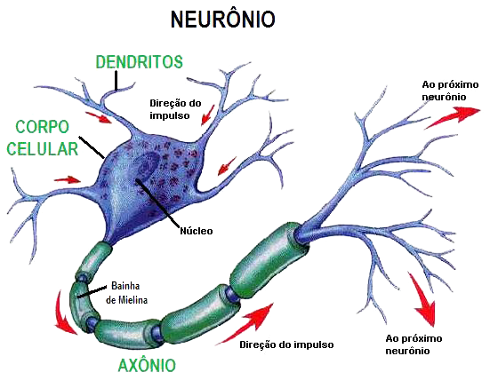
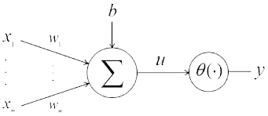
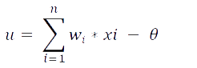
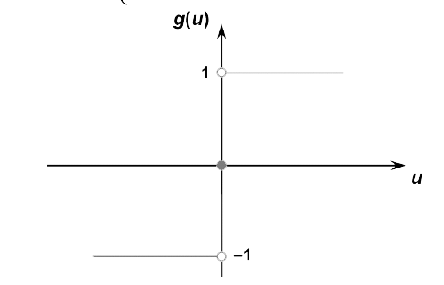
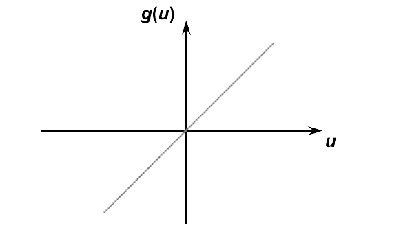

Você já ouviu falar sobre **Redes Neurais Artificiais** ? tem alguma idéia do que se trata ? não ? vamos lá, você está no lugar certo então.

#### Oque é uma Rede Neural Artificial ?
Uma rede neural artificial é nada mais que técnicas computacionais para adquirir conhecimentos através de experiências, seja essa experiência de qualquer forma que vier.



Uma rede neural é baseada nos neurônios do corpo humano que atuam principalmente na parte do  raciocínio.

O primeiro modelo de um neurônio artificial foi descrito por Warren McCulloch e Walter Pitts em 1943. Este modelo de neurônio artificial ficou conhecido como **MCP** por causa de seus criadores **M**c**C**ullhoch e Walter **P**itts.

#### O Modelo MCP


A estrutura do modelo MCP consiste basicamente em :

* Sinais de Entradas (_x0, x1 .. xn_)
* Pesos de Entrada (_w0, w1 .. wn_)
* Função de Ativação
* Sinais de saida

Basicamente no modelo MCP, vamos entrar com sinais de entrada, pesos normalmente randomicos entre **0 < wi < 1**, sempre com o **x0** começando com _-1_



A imagem acima é a fórmula como a qual é descrita o calculo no modelo MCP. Apos obter o resultado de _u_, vamos partir para jogar o resultado em uma **função ativadora** para podermos ter um sinal de saida.


#### Funções Ativadoras

##### Função degrau


A função degrau diz que se o resultado de _u_ em função dela, o resultado for **>= 0** você sempre obterá como resultado o valor _1_.

Caso o valor do resultado de _u_ em função dela for **< 0** você sempre obterá o valor _0_.

##### Função degrau bipolar



A função degrau bipolar é bem parecida com a função bipolar, a diferença entre as duas é apenas nas saidas de dados.

``` python

u > 0  SAIDA = 1
u == 0  SAIDA = 0
u < 0  SAIDA = -1

```

##### Função linear



A função linear o resultado de `g(u) = u`


Temos mais funções de ativação mais complexas, não vou entrar muito em detalhes com elas, se você é uma pessoa curiosa, aconselho a pesquisar

* Função de logística
* Função de Tangente hiperbólica
* Função Gaussiana (**Aconselho fortemente pesquisar sobre**)

Muito facil né ?


Isto foi uma introdução bem básica as redes neurais, mostrando oque séria uma rede neural, a estrutura de uma rede neural MCP e funções de ativação :)

Até a próxima =D
